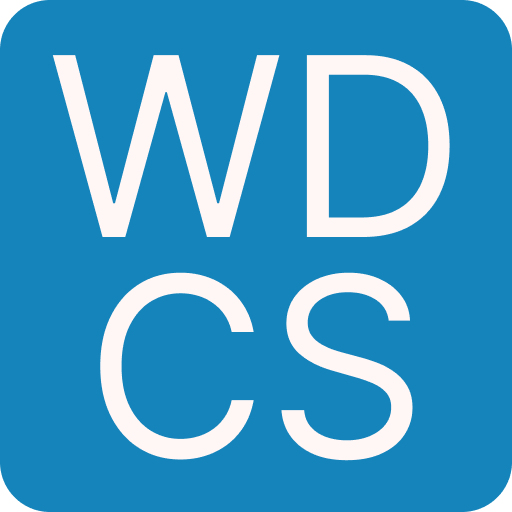

[![Contributors][contributors-shield]][contributors-url]
[![Forks][forks-shield]][forks-url]
[![Stargazers][stars-shield]][stars-url]
[![Issues][issues-shield]][issues-url]
[![project_license][license-shield]][license-url]
[![LinkedIn][linkedin-shield]][linkedin-url]

 

  

<h3 align="center">Web Dev Cheat Sheet</h3>
  
  

    Simple Educational Project
     
    <a href="https://github.com/andrewsrgn/web-dev-cheat-sheet"><strong>Explore the docs »</strong></a>
     
     
    <a href="https://andrewsrgn.github.io/web-dev-cheat-sheet" target="_blank">View Demo</a>
  

## About The Project

This is a simple educational project created as part of a course assignment. It serves as a quick reference guide for basic web development concepts. The project is still a work in progress and may not be completed.

[contributors-shield]: https://img.shields.io/github/contributors/andrewsrgn/web-dev-cheat-sheet.svg?style=for-the-badge
[contributors-url]: https://github.com/andrewsrgn/web-dev-cheat-sheet/graphs/contributors
[forks-shield]: https://img.shields.io/github/forks/andrewsrgn/web-dev-cheat-sheet.svg?style=for-the-badge
[forks-url]: https://github.com/andrewsrgn/web-dev-cheat-sheet/network/members
[stars-shield]: https://img.shields.io/github/stars/andrewsrgn/web-dev-cheat-sheet.svg?style=for-the-badge
[stars-url]: https://github.com/andrewsrgn/web-dev-cheat-sheet/stargazers
[issues-shield]: https://img.shields.io/github/issues/andrewsrgn/web-dev-cheat-sheet.svg?style=for-the-badge
[issues-url]: https://github.com/andrewsrgn/web-dev-cheat-sheet/issues
[license-shield]: https://img.shields.io/github/license/andrewsrgn/web-dev-cheat-sheet.svg?style=for-the-badge
[license-url]: https://github.com/andrewsrgn/web-dev-cheat-sheet/blob/master/LICENSE.txt
[linkedin-shield]: https://img.shields.io/badge/-LinkedIn-black.svg?style=for-the-badge&logo=linkedin&colorB=555
[linkedin-url]: https://linkedin.com/in/andrewsrgn
